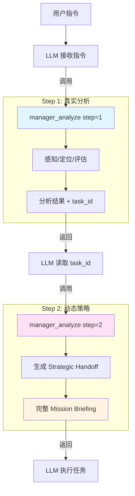

# 第3章 Manager 调度核心

> **"Manager 不是指挥官，而是战术情报官。"**
> 
> Manager 是 LLM 的 **"即时上下文与提示注入器" (On-Demand Context & Prompt Injector)**。
> 它不强制掌控每一轮对话，而是在复杂任务启动时，通过高密度的 **情报包 (Intel Package)**，将散落在项目中的代码实体、架构约束和历史记忆聚合为单一的 JSON 对象，为 LLM 提供决策支撑。

> **更新日期**: 2026-02-04
> **所属章节**: 第3章
> **版本**: Go MCP Server v2.0

---

## 3.0.1 MPM 的本质：认知增强框架

MPM 的核心价值不仅在于提升代码准确性，更在于通过**定向信息清洗与注入**，实现对 LLM 认知能力的增强。

### 1. 信息质量控制

传统 AI 助手的工作模式：

```
用户 → 模型自由思考 → 输出结果
       ↑
    黑盒推理，信息过载
```

MPM 增强模式：

```
用户 → Manager 清洗信息 → 锚定上下文 → 模型推理 → 结构化输出
                ↑                      ↑
           质量控制              注意力引导
```

**核心差异**：

- 传统模式：模型需要在海量信息中自行筛选，容易产生幻觉或遗漏
- MPM 模式：Manager 预先过滤噪音，只注入高价值、强相关的上下文

### 2. 注意力锚定

LLM 的"推理"本质上是**注意力分配**。MPM 通过以下机制引导模型聚焦：

| 机制                    | 作用                      |
| --------------------- | ----------------------- |
| **Context Anchors**   | 强制锚定在正确的代码位置，防止模型"盲目搜索" |
| **Guardrails**        | 设置行动边界，防止注意力漂移到无关区域     |
| **Strategic Handoff** | 提供结构化的下一步建议，避免模型"发散思考"  |

**效果**：模型把算力用在"正确的地方"，而非"到处乱撞"。

### 3. 推理框架适配

不同模型的特性差异很大，MPM 通过统一的信息注入框架进行适配。

> **💡 实践提示**：MPM 对于熟悉代码库的开发者较为友好，能显著提升效率。详见 [第7章 Vibe Coding 最佳实践](./07-VIBE-CODING.md)。

---

## 3.1 核心架构：为 Agent 定制的 OODA

Manager 采用经典的 OODA (Observe-Orient-Decide-Act) 循环来辅助 LLM 进行任务规划。

### 3.1.1 核心流程



### 3.1.2 详细步骤

#### 步骤1：真实分析 (step=1)

**1. 输入接收** (LLM 提供)

- **参数接收**: 接收 LLM 提供的 task_description、intent、symbols、scope、read_only、step、task_id
- **意图推断**: 如果 LLM 未指定 intent，Manager 根据关键词自动推断
- **注意**: 意图识别和符号提取由 LLM 在调用前完成，Manager 只负责接收和验证

**2. Orient (定位)**

- **符号定位**: 使用 `ASTIndexer.SearchSymbolWithScope()` 搜索符号的物理位置
- **记忆加载**: 从 `MemoryLayer` 加载已验证事实
- **复杂度评估**: 基于 Dice 算法评估目标文件复杂度

**3. Decide (决策)**

- 构建工程禁令 (Guardrails)
- 生成警告和建议 (Alerts)

**4. 状态保存**

- 将分析结果保存到 Session 状态（以 task_id 为键）
- 返回分析结果 + task_id

#### 步骤2：动态策略 (step=2)

**5. Strategic Handoff 生成**

- **基于真实分析**: 读取步骤1保存的 AnalysisState
- **动态决策**: 根据代码定位情况、复杂度、约束条件，动态生成 strategic_handoff
  - 未定位到符号 → 建议使用 project_map/code_search
  - 复杂度高 → 建议先 code_impact 分析影响范围
  - 列出所有 Critical 约束
  - 根据实际情况给出工具策略

**6. 完整输出**

- 返回完整的 Mission Briefing JSON（含 strategic_handoff）
- 清理 Session 临时状态

#### Handoff (移交)

- **战略交付**: Manager 隐退，控制权移交给 LLM
- **Vibe Coding 规范**: AI 友好的编码约定

---

## 3.2 意图分类 (Intent Classification)

Manager 支持 7 种任务意图，LLM 可在调用时主动指定，或由 Manager 根据关键词自动推断。

### 3.2.1 意图类型

| 意图              | 适用场景           | 特定约束                           |
|:--------------- |:-------------- |:------------------------------ |
| **DEBUG**       | 修复 bug、处理报错、崩溃 | VERIFY_FIRST, NO_BLIND_REWRITE |
| **DEVELOP**     | 开发新功能、添加模块     | 无特定约束                          |
| **REFACTOR**    | 重构代码、清理冗余      | 小步快跑，每步可验证                     |
| **DESIGN**      | 架构设计、技术选型      | NO_CODE_EDIT, MD_ONLY          |
| **RESEARCH**    | 分析代码、调研技术      | READ_ONLY                      |
| **PERFORMANCE** | 性能优化、瓶颈分析      | PROFILE_FIRST, MEASURE_AFTER   |
| **REFLECT**     | 系统性回顾历史决策      | READ_ONLY, EVIDENCE_BASED      |

### 3.2.2 意图推断机制

当 LLM 未明确指定意图时，Manager 会根据任务描述中的关键词自动推断。

**推断优先级**: DEBUG > REFACTOR > RESEARCH > DESIGN

> **注意**: 
> 1. 若未匹配到关键词且开启 `read_only` 模式，将自动推断为 `RESEARCH`。
> 2. 若均未匹配，系统将不指定默认意图（Intent 为空），此时仅应用基础工程约束。

---

## 3.3 智能感知与定位 (Observe & Orient)

### 3.3.1 LLM 预处理层参数

Manager 接受 LLM 主动提供的上下文参数，显著提升分析精度：

| 参数                   | 类型       | 默认值   | 说明                    | 示例                             |
|:-------------------- |:-------- |:----- |:--------------------- |:------------------------------ |
| **task_description** | string   | -     | 用户的原始指令（必填）           | "修复登录页面的样式问题"                  |
| **intent**           | string   | 自动识别  | LLM 自主判断的任务意图         | "DEBUG"                        |
| **symbols**          | []string | []    | LLM 提取的代码符号           | ["LoginForm", "validateInput"] |
| **read_only**        | bool     | false | 是否为只读模式               | true                           |
| **scope**            | string   | -     | 任务范围描述                | "前端登录模块"                       |
| **step**             | int      | 1     | 执行步骤：1=分析，2=生成策略      | 1                              |
| **task_id**          | string   | -     | 步骤2时必填，步骤1返回的 task_id | "analyze_1234567890"           |

### 3.3.2 符号定位机制

符号定位使用 Go 版本的 AST Indexer，通过调用 `SearchSymbolWithScope()` 方法执行符号搜索。

**搜索流程**：

1. 调用 AST Indexer 的搜索方法，传入项目根目录、符号名和搜索范围
2. 检查返回结果是否有效
3. 从结果中提取符号节点信息
4. 构建代码锚点，包含符号名、文件路径、行号和类型

**特性**：

- 支持多种语言：Go, Rust, Python, JavaScript, TypeScript
- 返回精确的文件路径和行号
- 限制最多搜索 10 个符号（避免 token 浪费）

### 3.3.3 复杂度评估与风险警告

Manager 使用 Dice 算法对任务相关的代码文件进行复杂度评估。

**评估流程**：

1. 调用 `AnalyzeComplexity()` 方法分析指定符号的复杂度
2. 遍历高风险符号列表
3. 对于分数 >= 50 的符号，生成复杂度警告，包含符号名、分数和原因
4. 将警告添加到警告列表中

**风险等级**：

- **高风险 (≥50分)**: 建议使用 `code_impact` 进行影响分析
- **中风险 (≥20分)**: 谨慎修改
- **低风险 (<20分)**: 可安全修改

---

## 3.4 情报包 (Mission Briefing)

Manager 返回一个结构化的 JSON 对象，整合了所有环境情报。

### 3.4.1 核心数据结构

```typescript
interface MissionBriefing {
  mission_control: {
    intent: string;          // 任务意图类型
    user_directive: string;  // 用户指令摘要（最多300字符）
  };

  context_anchors: Array<{
    symbol: string;  // 符号名称
    file: string;    // 文件路径
    line: number;    // 行号
    type: string;    // 符号类型
  }>;

  verified_facts: Array<{
    source: string;  // 来源固定为 "atomic_memory_index"
    key: string;     // 事实类型
    value: string;   // 事实描述
  }>;

  pending_hooks: string[];  // 格式: "PRIORITY: Description"

  telemetry: {
    complexity: {
      score: number;   // 最高复杂度分数
      level: string;   // 等级 (High/Medium/Low)
    };
  };

  guardrails: {
    critical: string[];  // 必须遵守的禁令
    advisory: string[];  // 建议性约束
  };

  alerts: string[];  // 警告和建议列表

  strategic_handoff: string;  // 结构化的下一步指导
}
```

### 3.4.2 为什么是 JSON?

1. **Attention Anchoring**: JSON Key 是天然的注意力锚点
2. **Token Efficiency**: 相比文本墙节省 Token
3. **Deterministic**: 消除幻觉空间，强制基于数据思考

---

## 3.5 工程禁令 (Guardrails)

根据任务意图动态生成的行动约束。

### 3.5.1 Critical 禁令（必须遵守）

| 意图           | Critical 禁令                    |
| ------------ | ------------------------------ |
| **RESEARCH** | `READ_ONLY: 只读模式，禁止任何文件修改`     |
| **DESIGN**   | `MD_ONLY: 只输出 Markdown，禁止代码编辑` |
| **DEBUG**    | `VERIFY_FIRST: 修改前必须先定位根因`     |
| **REFACTOR** | `NO_BLIND_REWRITE: 禁止盲目重写`     |

### 3.5.2 Advisory 约束（建议遵守）

通用约束包括：

- `最小变更，不做大爆炸重构`
- `每次修改后验证可运行性`

---

## 3.6 Vibe Coding 规范

Manager 自动注入的编码约定：

```
[Vibe Coding 规范]
✅ 建议：AI友好命名，函数名即文档，最简代码，如无必要勿增实体
❌ 禁止：并行调试系统，遗留代码不清理，走捷径保留原路，擅自写文档
```

### 3.6.1 建议实践

- **AI 友好命名**: 函数名即文档，见名知意
- **最简代码**: 如无必要勿增实体
- **函数式思维**: 小函数、纯函数、易测试

### 3.6.2 禁止行为

- **并行调试系统**: 禁止同时维护多套调试逻辑
- **遗留代码不清理**: 修改时一并清理周边冗余
- **走捷径保留原路**: 不要"备份即废弃"，要直接删除
- **擅自写文档**: 只在用户明确要求时才创建文档

---

## 3.7 工具策略 (Tool Strategy)

Manager 强制执行 **反并发调用规则**：

```
[Tool Strategy]
🛑 Anti-Parallel: 严禁盲目并发调用工具。
• Skill: 调用 skill_load 后必须等待阅读内容，禁止同时行动。
• Code Tools: 使用 project_map/code_search/code_impact 定位代码，禁用 IDE 盲 grep。
• Step-by-Step: 观察 -> 思考 -> 下一步。一次只做一件事。
```

### 3.7.1 推荐流程

```
评估情报是否充分
  ↓
若充分 → 拟定工程化指令，询问用户确认后再执行
  ↓
若不足 → 调用 project_map/code_search 补充（根据已有信息量自选）
```

---

## 3.8 辅助功能

### 3.8.1 Hook 断点系统

Hook 支持跨会话断点续传：

| 工具                          | 功能                                      |
| --------------------------- | --------------------------------------- |
| `// "建立任务断点"`<br>`manager_create_hook`       | 创建断点（支持优先级、过期时间、自定义标签）                  |
| `// "列出所有待办清单"`<br>`manager_list_hooks`        | 查看待办 Hook 列表（格式: PRIORITY: Description） |
| `// "标记任务已完成"`<br>`manager_release_hook`      | 通过编号释放已完成的 Hook                         |
| `// "继续执行上次中断的任务"`<br>`task_chain(mode="resume")` | 断点续传：恢复中断的任务链                           |

**典型场景**：

1. 复杂任务做到一半需要中断
2. 调用 `manager_create_hook` 创建断点
3. 新会话开启时，`manager_list_hooks` 显示待办
4. 调用 `manager_release_hook` 或 `task_chain(mode="resume")` 继续

### 3.8.2 REFLECT 意图：系统性反思

REFLECT 意图用于系统性回顾历史决策：

- **只读模式**: 强制启用只读约束
- **推荐工具链**: `system_recall` → `open_timeline` → `project_map` → `wiki_writer`
- **基于事实**: 确保结论有据可依

---

## 3.9 调用示例

### 标准调用流程

**步骤1：真实分析**

```json
// "帮我分析并规划这个修复任务"
{
  "task_description": "修复用户登录时密码验证失败的问题",
  "intent": "DEBUG",
  "symbols": ["validatePassword", "LoginHandler"],
  "read_only": false,
  "scope": "认证模块",
  "step": 1
}
```

返回：`{ "step": 1, "task_id": "analyze_1234567890", ... }`

**步骤2：动态策略**

```json
// "基于刚才的分析生成执行策略"
{
  "task_description": "修复用户登录时密码验证失败的问题",
  "intent": "DEBUG",
  "symbols": ["validatePassword", "LoginHandler"],
  "read_only": false,
  "scope": "认证模块",
  "step": 2,
  "task_id": "analyze_1234567890"
}
```

返回：完整的 Mission Briefing（含基于真实分析生成的 strategic_handoff）

---

## 3.10 下一步

理解了 Manager 的情报聚合机制后，请参考：

* [第4章 代码解析器](./04-CODE-PARSER.md) —— 深入了解符号搜索背后的技术
* [第5章 数据库与记忆层](./05-DATABASE-MEMORY.md) —— 了解 Verified Facts 和 Hooks 的存储机制
