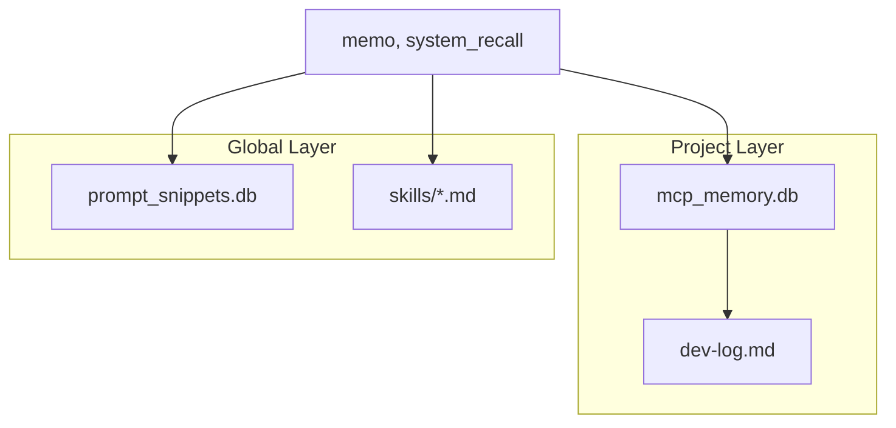

# 第5章 The Memory Engine (记忆引擎)

> **"Context 是大模型的稀缺资源，而结构化记忆是扩展认知的唯一途径。"**

Memory Engine 是 MPM 的**"长期记忆中枢"**。它解决了 AI 开发中最痛苦的问题：聊着聊着就忘了之前说了什么，明明上次解决过的问题，这次又要从头来。

> **更新日期**: 2026-02-04
> **所属章节**: 第5章
> **版本**: Go MCP Server v2.0

**价值**: **让 AI 拥有"项目级长期记忆"，跨会话积累经验。**

---

## 5.1 认知架构：双层记忆系统

MPM 的记忆系统旨在解决 **"无限的工程实践"** 与 **"有限的 Context 窗口"** 之间的核心矛盾。

### 双轨机制与作用域隔离

| 组件 | 技术载体 | 认知角色 | 作用域 |
| :--- | :--- | :--- | :--- |
| **LTS** | SQLite (`.mcp-data/mcp_memory.db`) | 💾 项目硬盘 | Project. 存储项目内的任务、备忘、事实 |
| **Global** | SQLite (`.mcp-data/.../prompt_snippets.db`) | 🌍 共有知识库 | Global. 跨项目的通用提示词、Snippets |
| **Memo Log** | `dev-log.md` | 📝 唤醒快照 | Project. 项目级的原子日志快照 |
| **Skill Index** | 文件系统 (`skills/`) | 🧠 技能图谱 | Global. 只读的通用技能库 |

---

## 5.2 核心记忆单元 (Memory Units)

Memory Engine 不仅仅是存储字符串，它将项目经验结构化为四种核心单元：

### 1. Memos (工程日志) - SSOT
**这是项目的唯一真理来源 (Single Source of Truth)。**
它不再是杂乱的对话记录，而是结构化的决策历史。

| 核心要素 | 说明 | 示例 |
|:---|:---|:---|
| **Category** | 操作类型 | `修改` / `修复` / `重构` / `决策` |
| **Entity** | 操作对象 | `Manager.analyze` (具体的函数或模块名) |
| **Act** | 关键动作 | `修复空指针异常` |
| **Content** | 深度上下文 | 记录"为什么这么改"，而不仅仅是"改了什么" |

> **同步机制**: 每次写入 Memo，系统会自动将其追加到项目根目录的 `dev-log.md`，方便人类查阅。

### 2. Known Facts (经验铁律)
用于存储经过验证的规则和避坑指南。当 AI 在未来遇到类似场景时，`manager_analyze` 会自动召回这些经验。

| 类型 | 说明 | 用途 |
|:---|:---|:---|
| **避坑 (Pitfall)** | 记录曾经踩过的坑 | "修改 Session 逻辑前必须备份数据" |
| **铁律 (Rule)** | 项目特定的硬性规定 | "所有 API 请求必须包含 X-Request-ID" |

### 3. Pending Hooks (待办钩锁)
处理跨越 Session 的异步关注点或阻塞项。它像一个"钩子"，将当前无法完成的任务挂起，防止被遗忘。

*   **特点**: 支持设置优先级、过期时间和关联任务 ID。
*   **状态循环**: Open (挂起) -> Released (闭合/完成)。

### 4. Tasks (任务链)
存储复杂任务的执行状态、计划和进度，支持任务的断点续传。

---

## 5.3 工具映射 (Tool Mapping)

作为用户或 Agent，你不需要直接操作数据库，而是通过以下工具与记忆引擎交互：

| 记忆类型 | 写工具 (Write) | 读/召回工具 (Read) |
|:---|:---|:---|
| **备忘录 (Memo)** | `memo` | `system_recall` ⭐ |
| **事实 (Fact)** | `known_facts` | `manager_analyze` (自动), `system_recall` |
| **钩子 (Hook)** | `manager_create_hook` | `manager_list_hooks` |
| **任务 (Task)** | `task_chain` | `task_chain` |
| **提示词** | `save_prompt_from_context` | 自动匹配 |

> **⭐ system_recall 的独特价值**:
> 
> 不同于简单的关键词搜索，`system_recall` 采用**"宽进严出"**策略：
> - **宽进**: 在 Entity/Act/Content 多字段中模糊匹配
> - **严出**: 通过 category/scope/limit 精细过滤
> - **精细输出**: 分类展示 + 时间戳 + 完整上下文
> 
> 这让你能精确定位"上次修改这个函数时做了什么"、"之前是怎么解决这个问题的"等历史决策。

---

## 5.4 存储与维护

*   **位置**: 所有项目级记忆存储于 `.mcp-data/mcp_memory.db` (SQLite)。
*   **物理备份**: 每次通过 `memo` 写入记忆时，系统都会在 `dev-log-archive/memo_archive.jsonl` 中追加一条 JSON 行，作为与数据库解耦的操作日志，可在数据库损坏或丢失时重放恢复 `memos` 表的核心数据。
*   **Git 策略**: 建议将 `.mcp-data/` 添加到 `.gitignore`，但可以将 `dev-log.md` 以及 `dev-log-archive/` 中的归档文件提交到仓库以共享项目历史与灾难恢复能力。
*   **并发**: 采用 WAL (Write-Ahead Logging) 模式，支持多 Agent 并发读写，无需担心锁冲突。
*   **自愈**: 服务器每次启动时不仅检查连接，还会自动尝试修复丢失的表结构。

---

## 5.5 下一步

*   [第6章 高级功能](./06-ADVANCED.md) - Persona、HUD、Skill 等详解
*   [第8章 工具参考](./08-TOOLS.md) - 完整工具列表

---

*End of Memory Engine Manual*
