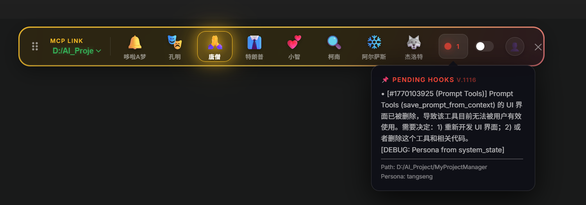
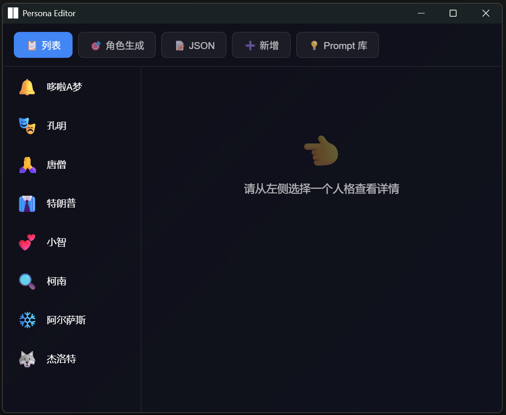
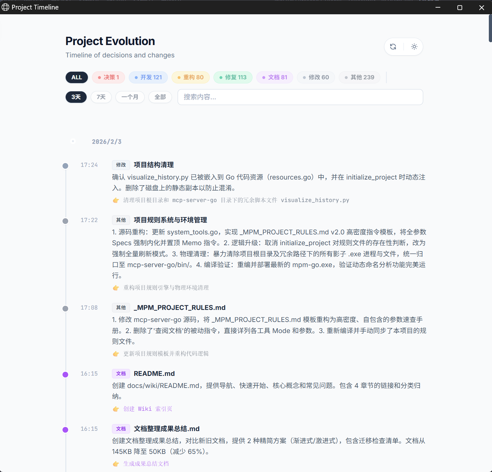

# 第6章 Power Tools (认知增强)

> **"工具定义了能力的边界。MPM 的高级工具不仅是功能的堆叠，更是对 AI 认知模式的扩展。"**

在前几章，我们介绍了文件操作、代码分析和记忆系统。在这一章，我们将解锁 MPM 的**"完全体"**形态。这些工具将不仅帮助你写代码，还能改变你的**思考方式**、**工作流**甚至**人格**。

> **更新日期**: 2026-02-04
> **所属章节**: 第6章
> **版本**: Go MCP Server v2.0

---

## 6.1 你的全息驾驶舱 (Cockpit HUD)

> **工具**: `open_hud`

**HUD (Heads-Up Display)** 是 MPM 的可视化监控终端。它是一个独立运行的高性能 Rust GUI 程序，像钢铁侠的头盔界面一样，悬浮在你的桌面一角。

### 核心价值

当你在与 AI 进行激烈的结对编程时，你很难分心去查看后台日志。HUD 解决了这个问题：

* **实时心跳监控**: 确认 MPM Server 是否存活，连接是否正常。
* **状态可视化**: 显示当前项目、服务器状态。
* **待办钩子显示**: 实时显示待办事项数量和摘要。
* **当前人格显示**: 显示当前激活的 AI 人格。

### 使用方法

```javascript
// "启动 HUD 监控悬浮窗"
open_hud()
```

> **注**: HUD 需要本地图形界面环境支持。

### HUD 界面预览

| 悬浮球模式 (Mini) | 展开面板 (Dashboard) | 人格切换 (Persona) |
| :---: | :---: | :---: |
|  |  |  |
| *常驻桌面的状态监视* | *点击展开查看详细指标* | *快速切换 AI 人格* |

---

## 6.2 认知重塑：Persona System (人格矩阵)

> **工具**: `persona`

**不要以为这只是"角色扮演" (Roleplay)。**
在 Prompt Engineering 中，Persona 是最强大的**System Prompt Injection**技术之一。通过切换人格，你实际上是在切换 LLM 的**思维协议**和**注意力偏置**。

### 预设人格与效用

MPM 内置了多位"领域专家"，他们不仅仅语气不同，关注点也截然不同：

| 人格             | 代号                | 认知特征                                                 | 适用场景                         |
|:-------------- |:----------------- |:---------------------------------------------------- |:---------------------------- |
| **孔明 (Zhuge)** | `zhuge`           | **严谨、宏观、慎重**。<br>倾向于深思熟虑，关注架构的稳健性和长远隐患。说话偏文言，逻辑极强。   | **架构设计**、**代码审查**、**复杂逻辑诊断** |
| **懂王 (Trump)** | `trump`           | **极度自信、直觉驱动、打破常规**。<br>忽视细节，关注结果，有时能提出意想不到的"暴力美学"解法。 | **头脑风暴**、**快速原型**、**打破僵局**   |
| **哆啦 (Dora)**  | `doraemon`        | **耐心、教学导向、工具丰富**。<br>总是试图解释清楚每一个步骤，并主动提供道具（工具）帮助。    | **学习新技术**、**新手引导**、**编写教程**  |
| **柯南 (Conan)** | `detective_conan` | **细节强迫症、推理驱动**。<br>绝不放过任何蛛丝马迹，坚持"真相只有一个"。            | **Bug 排查**、**日志分析**、**根因定位** |

### 使用方法

```javascript
// "查看有哪些人格"
persona(mode="list")

// "切换到孔明模式"
persona(mode="activate", name="zhuge")
```

---

## 6.3 领域专家：Skill System (技能系统)

> **工具**: `skill_list`, `skill_load`

LLM 的训练数据截止于过去，但技术永远在迭代。Skill System 是 MPM 的**动态知识挂载机制**。

每一个 **Skill** 都是一个包含专家知识、SOP (标准作业程序)、最佳实践代码和辅助脚本的文件夹。加载 Skill，相当于给 Agent 临时插上了一张"黑客帝国"式的技能芯片。

> **兼容性提示**: MPM 的 Skill 机制设计**完全兼容 Claude Desktop 的 MCP Skill 规范**。你可以直接复用社区现有的 Claude Skills，实现生态互通。

### 技能包结构

一个典型的 Skill (如 `swe-bench`) 包含：

*   `SKILL.md`: 核心操作指南 (SOP)
*   `scripts/`: 自动化脚本 (如 `run_test.py`)
*   `templates/`: 代码模板
*   `conversations/`: 少量示例对话 (Few-Shot Examples)

### 工作流 (Skill-Driven Development)

1.  **发现**: "我想解决 SWE-Bench 的问题，但我不知道怎么弄。"
    
    ```javascript
    // "查看可用技能"
    skill_list() // 查看有没有相关技能
    ```
2.  **加载**: "加载 SWE-Bench 专家模块。"
    
    ```javascript
    // "加载 SWE-Bench 技能"
    skill_load(name="swe-bench", level="full")
    ```
3.  **执行**: Agent 阅读 `SKILL.md`，严格按照其中的 SOP 进行操作，并调用 `scripts/` 下的工具。

---

## 6.4 项目 DNA：Timeline (演进视图)

> **工具**: `open_timeline`

(承接第 5 章记忆系统) 当通过 User Interface 无法看清项目全貌时，Timeline 将 Git Log、Memos 和关键决策点融合为一张**可交互的 HTML 演进图谱**。

### 核心价值

*   **可视化决策链**: 不只看代码变了什么，还看**为什么变** (关联的 Memo)。
*   **模式识别**: 快速发现项目中频繁重构的"热点"（潜在的技术债聚集地）。

### 使用方法

```javascript
// "打开 Timeline"
open_timeline() // 自动生成 project_timeline.html 并打开浏览器
```



---

## 6.5 全局知识库：Prompt Manager

> **工具**: `save_prompt_from_context`

这是你的**Prompt Snippets Lab**。不要让那些精心调试过的 Prompt 用完即弃。

### 双层作用域 (Scope)

*   **Project Scope**: 当前项目专用。例如：*本项目特有的测试数据生成 Prompt*。
*   **Global Scope**: 跨项目共享。例如：*通用的 Go 语言 Error Handling 检查清单*。

### 最佳实践

当你发现某一轮对话中，Agent 的输出特别完美，立即保存这一瞬间的 Context：

```javascript
// "保存当前 Prompt"
save_prompt_from_context(
    title="高质量 Go 单元测试生成器",
    content="你现在是一个 Go 测试专家，请遵循以下 Table Driven Tests 模板...",
    tag_names="go,test,template",
    scope="global"
)
```

下次，你只需要说："加载那个 Go 测试生成的 Prompt"，Agent 就会自动去库里检索。

---

## 6.6 下一步

现在，你已经掌握了 MPM 的所有核心武器：

* **Finder**: 看清代码
* **Manager**: 规划任务
* **Memory**: 记住历史
* **Power Tools**: 增强认知

最后一章，我们将探讨一种全新的编程哲学——**Vibe Coding**，并结束本手册。

* [第7章 Vibe Coding](./07-VIBE-CODING.md) - 顺势而为的编程艺术
* [第8章 工具参考](./08-TOOLS.md) - 完整工具字典

---

*End of Advanced Features Manual*
